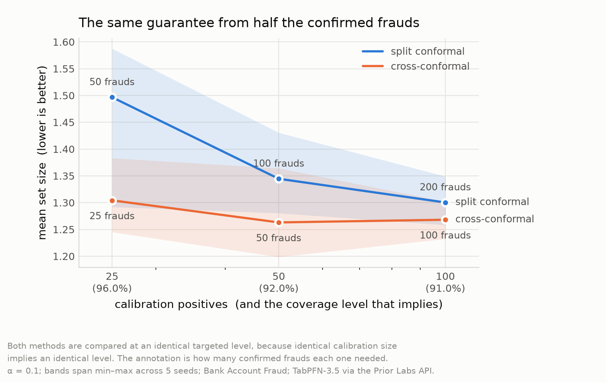
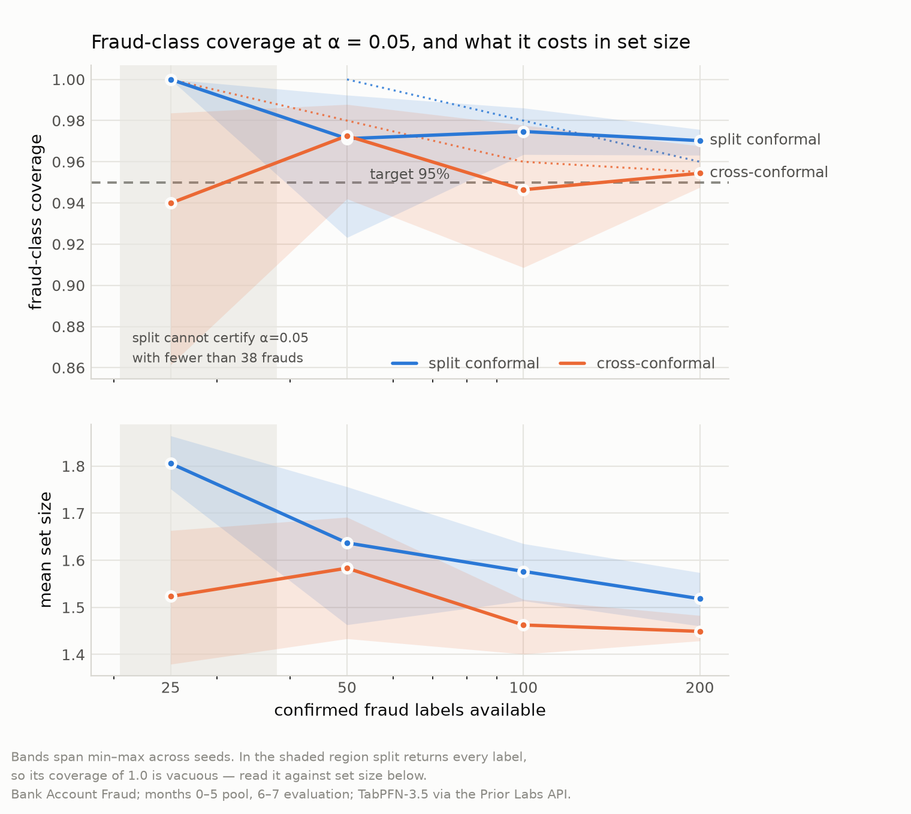
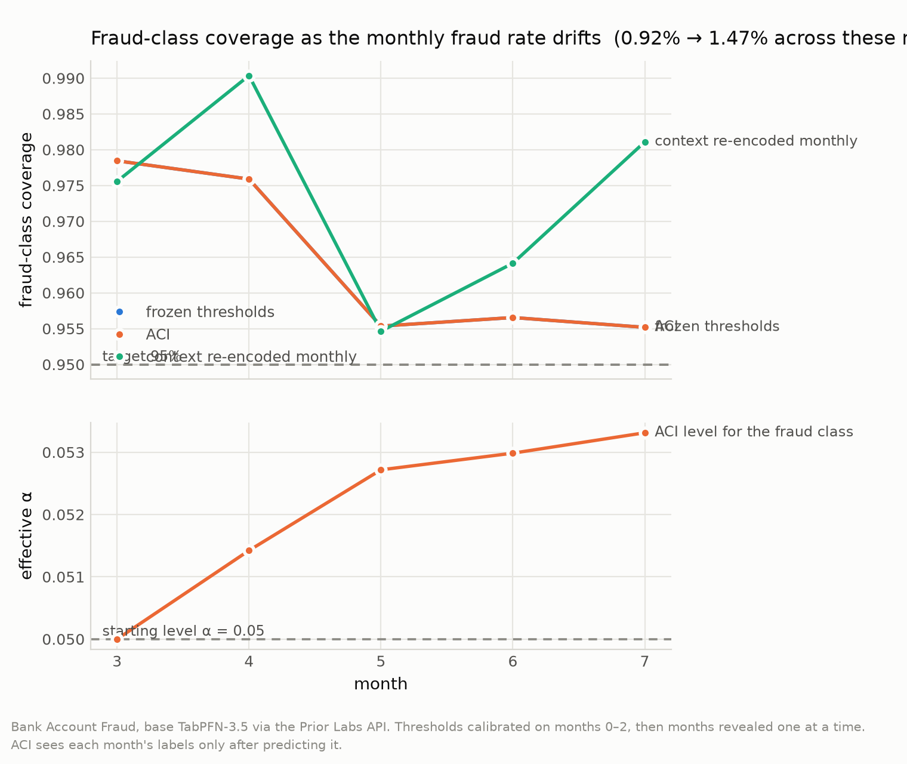
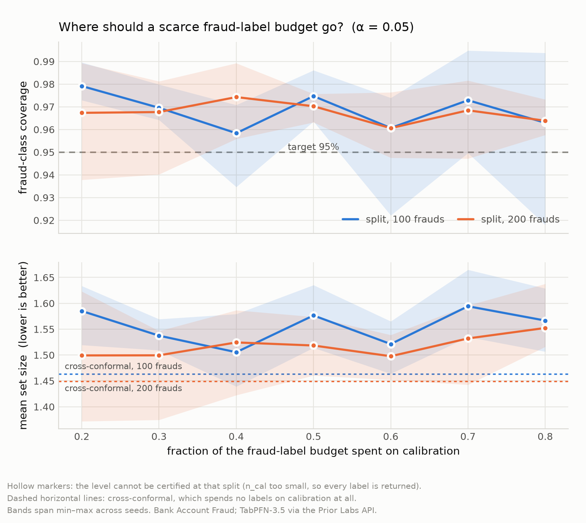

# tabpfn-conformal

**Cross-conformal reaches the same coverage guarantee from half the confirmed
frauds — and that is only affordable because TabPFN never trains.**

With a hundred confirmed frauds, the 99% guarantee a regulator asks for is
mathematically unavailable to standard practice. This makes it available.

Conformal prediction turns a model's probabilities into prediction sets with a
distribution-free coverage guarantee. Split conformal — the default everyone
uses — holds out half your labels to calibrate that guarantee. With a fraud base
rate near 1%, a pool of 10,000 transactions holds roughly a hundred frauds, and
split conformal spends fifty of them on calibration instead of on the model.

That trade only ever made sense because the alternative meant retraining.
**TabPFN-3.5 has no training step** — `fit` swaps the in-context set and takes no
gradient — so K-fold cross-conformal is K forward passes, and every fraud label
can be both context *and* calibration.

```python
from tabpfn_conformal import ConformalClassifier

cc = ConformalClassifier(model, method="mondrian", strategy="cross", n_folds=5)
cc.fit(X_pool, y_pool)
sets = cc.predict_set(X_new, alpha=0.05)   # (n, 2) bool: is each label in the set?
```

`strategy="split"` → `"cross"` is the whole diff.

> **Work in progress** for the Prior Labs TabPFN-3.5 Hackathon (deadline 6 Oct
> 2026). The library and its 86 tests are complete and run on CPU in under a
> second. Experiments are running; every number below is measured and the
> results files are committed. Two of our own pre-registered predictions have
> already been falsified and are reported as such — see
> [Results](#results-so-far) and [`docs/limitations.md`](docs/limitations.md).

## The argument

### 1. There is a hard ceiling on what split conformal can promise

Conformal's threshold is the ⌈(n+1)(1−α)⌉-th smallest calibration score, and that
index cannot exceed `n`. So a calibration set of size `n` can only certify
**α ≥ 1/(n+1)** — below that, no threshold exists and the predictor must return
every label. Split conformal calibrates on half your positives. Cross-conformal
calibrates on all of them:

| confirmed frauds | split can certify | cross can certify |
|---:|---:|---:|
| 50 | 96.2% | **98.0%** |
| 100 | 98.0% | **99.0%** |
| 200 | 99.0% | **99.5%** |
| 400 | 99.5% | **99.75%** |

**Cross-conformal exactly halves the tightest guarantee obtainable.** This is
arithmetic, not a result — you can check it on paper, and it does not depend on
the dataset, the model, or a random seed.

### 2. Measured: the same guarantee from half the labels

Split conformal at a budget of 2F frauds calibrates on F of them — exactly as
cross-conformal at a budget of F does. **Identical calibration size means an
identical targeted level**, so these pairs compare directly on set width with no
confound, no interpolation and no matching on realised coverage. Measured on
Bank Account Fraud at α = 0.10:

| targeted level | split needs | its set size | cross needs | its set size | labels saved |
|---:|---:|---:|---:|---:|---:|
| 96.0% | 50 frauds | 1.497 | **25 frauds** | **1.304** (12.9% narrower) | **50%** |
| 92.0% | 100 frauds | 1.345 | **50 frauds** | **1.263** (6.1% narrower) | **50%** |
| 91.0% | 200 frauds | 1.300 | **100 frauds** | **1.268** (2.5% narrower) | **50%** |

Cross-conformal halves the number of confirmed frauds needed for any given
guarantee, and the sets are narrower rather than wider — in five of six
comparisons across α = 0.05 and 0.10, with the sixth a 0.4% tie. The advantage
grows as labels get scarcer, which is the regime that matters.

For a fraud desk, a hundred confirmed frauds is weeks of analyst work. Fifty
thousand API tokens is 0.25% of a monthly budget. Split conformal spends the
expensive resource to save the cheap one.

### 3. Split conformal does not deliver the level you ask for

The same rounding has a second consequence that is easy to miss. The index
rounds *up*, so a small calibration set silently targets a **higher** level than
requested:

| calibration positives | level actually targeted at α = 0.10 |
|---:|---:|
| 13 | **100.0%** — the threshold *is* the maximum score |
| 25 | 96.0% |
| 50 | 92.0% |
| 100 | 91.0% |
| 200 | 90.5% |

At any budget, split calibrates on half as many positives as cross, so split is
always the more conservative of the two. Measured on Bank Account Fraud at
α=0.10 with a budget of **50 confirmed frauds**: split calibrates on 25 of them,
targets 96%, and delivers **coverage 0.960 with mean set size 1.497**;
cross calibrates on all 50, targets 92%, and delivers **0.880 with set size
1.263**. Split's higher coverage is not better calibration — it is aiming at 96%
because it cannot aim at 90%, and paying for the overshoot in set width.

### 4. Under extreme imbalance, marginal conformal abandons the minority class

This part is **not our finding** — it is published
([arXiv:2607.27143](https://arxiv.org/abs/2607.27143); *MAKE* 8(7):190, both
2026) — and this library pins it as a regression test
(`tests/test_coverage.py`). Marginal conformal spends its error budget where the
mass is, so at a 1% base rate the fraud class can fall far below 1−α while the
headline number looks healthy. Class-conditional (Mondrian) calibration is the
fix, and it is the default here.

## Results so far

Bank Account Fraud (Feedzai, NeurIPS 2022), 1,000,000 rows at a 1.1029% fraud
rate. Temporal protocol: months 0–5 are the labelled pool, months 6–7 the
evaluation set — never a random split, because the fraud rate climbs from 0.875%
in month 2 to 1.475% in month 7. TabPFN-3.5 through the Prior Labs API.



Both methods sit at an identical targeted level at each x position, because
identical calibration size implies an identical level. The annotation is how
many confirmed frauds each one needed to get there.



Regenerate every figure from the committed results, no API key required:

```bash
python experiments/analyze_e1.py --alpha 0.1
python experiments/analyze_e1.py --alpha 0.05
```

### Against the baselines: TabPFN wins where it counts

At an identical targeted level, TabPFN produces **narrower prediction sets than
LightGBM in all four comparisons** — which is to say fewer cases land in a human
analyst's queue for the same guarantee:

| strategy | budget | targeted level | TabPFN | LightGBM | TabPFN narrower by |
|---|---:|---:|---:|---:|---:|
| split | 100 | 98.0% | **1.618** | 1.764 | 8.3% |
| split | 200 | 96.0% | **1.574** | 1.649 | 4.6% |
| cross | 100 | 96.0% | **1.471** | 1.680 | **12.4%** |
| cross | 200 | 95.5% | **1.459** | 1.566 | 6.8% |

Conformal prediction is what makes this measurable: it converts model quality
into the unit a fraud desk actually budgets for.

**Against TabPFN's own imbalance tooling**, which produces no guarantee at all:
`balance_probabilities` with a tuned threshold — the approach
[arXiv:2605.21742](https://arxiv.org/abs/2605.21742) found strongest for
prior-data fitted networks — reaches 0.92 recall while flagging **41% of
legitimate traffic**. Comparable recall, no promise it holds next month.

### Drift: adaptive calibration cannot help at this label budget

Across months 3–7 the fraud rate climbs 0.92% → 1.47% and frozen thresholds lose
about 2 points of coverage. Adaptive conformal inference **does not recover it** —
at γ ∈ {0.05, 0.2} it is *numerically identical* to doing nothing, and at
γ ∈ {0.5, 1.0} it is worse.



The reason is the same scarcity as everywhere else in this project. With `n`
calibration positives only `n` distinct thresholds exist, so α must move far
enough to change which order statistic is selected before anything changes at
all. At the 46 positives available here that step is **0.0139**; ACI moves α by
0.003 across the whole walk. Raise γ enough to move and it jumps a whole order
statistic and overshoots.

This is not a defect in ACI — and it points back at the headline, since
cross-conformal doubles the calibration set and so doubles threshold resolution.

### Where should a scarce label budget go? Mostly, nowhere

The question this project set out to measure. Sweeping `cal_size` from 0.2 to
0.8 at both budgets: at 100 frauds there is **no detectable optimum** (paired
best-vs-worst difference +0.089 ± 0.042, t=2.1, n=5). At 200 there is a real
effect, but it is `cal_size=0.8` being *bad* — starving the model — rather than a
sharp interior optimum.

**Cross-conformal beats every split setting, at both budgets and both alphas.**



### What we predicted, and what happened

Predictions were registered in [`docs/CAHIER-DES-CHARGES.md`](docs/CAHIER-DES-CHARGES.md)
before the experiments ran.

| | prediction | outcome |
|---|---|---|
| **P1** | cross-conformal has lower seed-variance of fraud coverage | **falsified** — 0.107 vs 0.083 at F=25 (cross better) but 0.044 vs 0.081 at F=100 (cross worse). No consistent direction. |
| **P2** | cross-conformal costs under 2× split in API tokens | **falsified** — measured exactly K×: 2.0× at K=2, 20.0× at K=20. The API prices a call by total rows touched, so each fold is a full pass over the pool. |
| **P3** | marginal CP under-covers the fraud class; Mondrian does not | holds (and was already published) |
| **P4** | static thresholds decay under drift; ACI holds coverage | **falsified** — ACI is identical to frozen at usable γ, for the quantization reason above. |
| **P5** | LightGBM cross-conformal costs far more wall-clock | **falsified** — ~6s against TabPFN's ~51s. Confounded (local vs remote), but the intuition was wrong: LightGBM trains on 9,000 rows in under a second. |

**Four of five failed.** What survives is sturdier for it: the feasibility
ceiling and level fidelity are *deterministic* — checkable on paper, not
falsifiable by more data — and the half-the-labels and baseline results are
measured at matched level with no confound.

### Cost, measured rather than claimed

`estimate_cost()` transmits dimensions only, so these cost nothing to obtain:

| context rows | normal | cached | saving |
|---:|---:|---:|---:|
| 50,000 | 10,000 | 10,000 | 0% |
| 100,000 | 19,039 | 10,000 | 47% |
| 200,000 | 68,319 | 17,080 | **75%** |
| 500,000 | 364,290 | 91,072 | **75%** |

Below ~100,000 context rows everything sits on a 10,000-token minimum charge, so
the documented KV-cache saving is real but invisible at small scale. Five folds
on a 10,000-row pool is roughly 50,000 tokens — about 0.25% of a monthly budget.
Cross-conformal is not cheap relative to split; it is cheap in absolute terms,
and labels are the resource that is actually scarce.

## Install

```bash
pip install -e ".[dev]"   # tests, plus everything needed to redraw the figures
pytest                    # 90 tests, CPU, ~10s on a cold clone
```

The core depends on **numpy, pandas and scikit-learn only** — no torch, no
`tabpfn`, no GPU. 86 tests in under a second on a laptop. TabPFN appears in
`experiments/` and is never imported by `src/`.

For the experiments you additionally need a free Prior Labs account:

```bash
pip install -e ".[experiments]"
python -c "import tabpfn_client; tabpfn_client.init()"
```

See [`experiments/api/README.md`](experiments/api/README.md) for the token,
budget discipline and rate limits.

## Library

| module | what it does |
|---|---|
| `scores.py` | nonconformity scores (`one_minus_prob` by default) |
| `calibration.py` | split-conformal quantiles: marginal and class-conditional |
| `crossconformal.py` | K-fold out-of-fold scoring |
| `adaptive.py` | adaptive conformal inference — online per-class levels under drift |
| `decision.py` | prediction sets → approve / block / review under a budget |
| `wrapper.py` | `ConformalClassifier`, scikit-learn compatible |
| `metrics.py` | coverage by class, set size, empty-set rate |

Three decisions worth knowing:

**`alpha` is a prediction-time argument.** Calibration stores the *scores*;
thresholds are derived on demand. Sweeping α costs no further calls to the base
estimator, which against a metered API is the difference between one billed pass
and thirty. `predict_set_from_proba` goes further — score once, sweep offline.

**`cal_size` is a constructor argument**, because how a scarce label budget
should be divided between a foundation model's context and its calibration set
is the open question this package was built to measure.

**Too few calibration points is a warning, not a silent clip.** When α cannot be
certified the library returns the trivial all-labels set and raises
`InsufficientCalibrationWarning`. This fires on real data: at 25 fraud labels it
fires for every α below 0.0714.

## Relation to MAPIE and crepes

[MAPIE](https://github.com/scikit-learn-contrib/MAPIE) and
[crepes](https://github.com/henrikbostrom/crepes) are mature libraries, and to be
explicit: **MAPIE 1.5 already ships both `SplitConformalClassifier` and
`CrossConformalClassifier`**, and crepes ships Mondrian classifiers.
Cross-conformal is a standard method (Vovk, 2015). This package did not invent
it and does not claim to.

Correctness is verified rather than asserted:
`tests/test_agreement_with_mapie.py` checks that our marginal split-conformal
prediction sets are **exactly identical** to MAPIE's with the `lac` score, across
three alphas and three seeds.

What is added on top: the label-budget allocation question as a first-class
parameter, α at prediction time for metered APIs, Mondrian combined with
cross-conformal in one object, online ACI for monthly drift, and a dependency
footprint small enough to vendor into
[`tabpfn-extensions`](https://github.com/PriorLabs/tabpfn-extensions) — which
today has interpretability, embeddings, unsupervised learning and Bayesian
optimization, but no conformal prediction at all.

## What we got wrong

[`docs/FINDINGS.md`](docs/FINDINGS.md) is a chronological log of every discovery
and every correction, including four claims this project made and then measured
to be false. Three of four pre-registered predictions were falsified. The
corrections are in the log because they are the most informative part of the
work, not despite being unflattering.

## Limitations

[`docs/limitations.md`](docs/limitations.md) is written for a reader looking for
the weak points. In brief: cross-conformal is *approximately* valid, not exactly
valid (CV+ worst case 1−2α); the feasibility boundary is about what can be
certified, not what is well estimated; coverage and set size must always be read
together, because a predictor returning every label has perfect coverage and no
value; and every cost claim this project originally made about cross-conformal
being nearly free was wrong and is corrected there.

## Licence

Apache 2.0 — see [`LICENSE`](LICENSE).

**TabPFN-3.5's model weights are released by Prior Labs under a separate,
non-commercial licence.** This package does not bundle, depend on, or
redistribute them; the experiment scripts reach TabPFN through the public
`tabpfn-client` API. Note also that TabPFN-3.5-Thinking and -Plus have **no local
weights at all** and exist only through the managed API.
