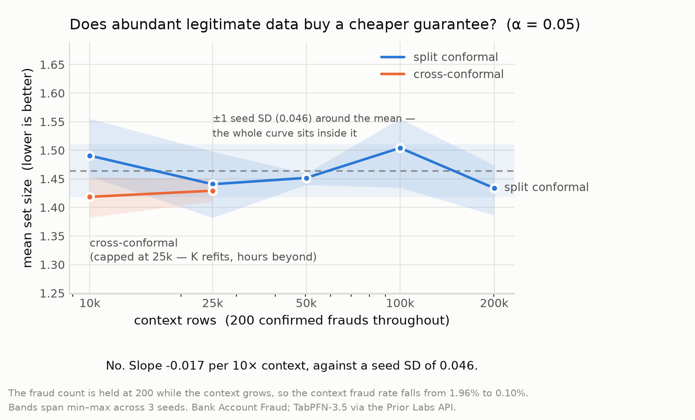
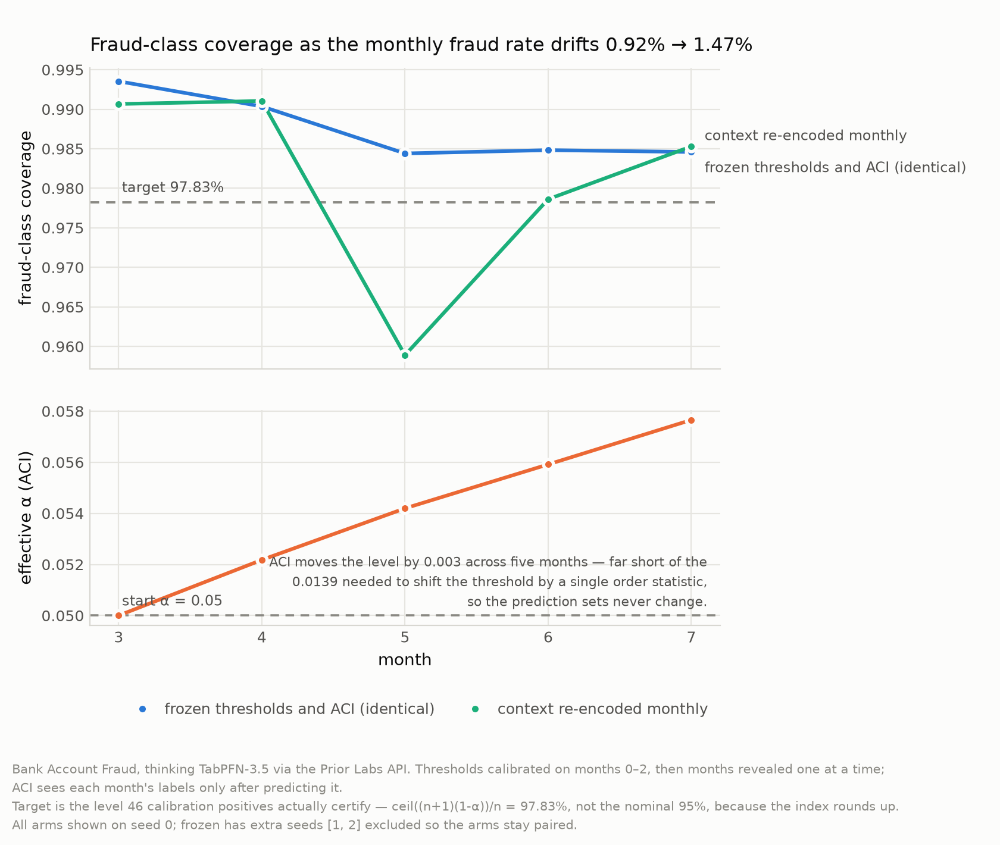

# tabpfn-conformal

[](https://github.com/ilyas-elm/tabpfn-conformal/actions/workflows/tests.yml)
[](LICENSE)

**Cross-conformal reaches the same targeted coverage level from half the
confirmed frauds, at no cost in set width, and on TabPFN-3.5 it costs zero
training runs to get there.**

It does cost something else, which we measured rather than assumed: split
conformal's guarantee is *exact*, cross-conformal's is only *approximate*, and
at tight α cross delivers about **two points less realized coverage than it
certifies**, where split holds. That is the honest trade, half the labels
against two points, and it is
[quantified below](#what-cross-conformal-actually-costs) on both datasets.

With a hundred confirmed frauds, the 99% guarantee a regulator asks for is
mathematically unavailable to standard practice. This makes it available.

Conformal prediction turns a model's probabilities into prediction sets with a
distribution-free coverage guarantee. Split conformal, the default everyone
uses, holds out half your labels to calibrate that guarantee. With a fraud base
rate near 1%, a pool of 10,000 transactions holds roughly a hundred frauds, and
split conformal spends fifty of them on calibration instead of on the model.

That trade only ever made sense because the alternative meant retraining.
**TabPFN-3.5 has no training step**. `fit` swaps the in-context set and takes no
gradient, so K-fold cross-conformal is K forward passes, and every fraud label
can be both context *and* calibration.

What TabPFN removes is the training: **0 gradient-trained fits against
LightGBM's 6** at K=5. That is the hardware-independent number and the reason
the method is affordable at all.

It does not make TabPFN *fast*, and this README is precise about that because an
earlier draft of it was not:
[what cross-conformal actually costs](#cost-measured-rather-than-claimed), in
tokens and in seconds on hardware where the comparison is fair, is measured
below. LightGBM wins the stopwatch.

> Built for the Prior Labs TabPFN-3.5 Hackathon. **All seven experiments are
> complete** and their results are committed, so every number below can be
> recomputed without an API key: `python scripts/verify_claims.py` recomputes
> 178 of them from `results/` and exits non-zero on any drift.
> **Four of five pre-registered predictions were falsified**, including two of
> our own about cost, and they are reported as such; see the
> [scoreboard](#what-we-predicted-and-what-happened),
> [`docs/limitations.md`](docs/limitations.md) and
> [`docs/FINDINGS.md`](docs/FINDINGS.md), which logs every correction in the
> order it was made.

## Everything measured, in one table

| | measured | where |
|---|---|---|
| Cross-conformal reaches the same targeted level from **half the confirmed frauds** | never significantly wider (0 of 9 paired tests); narrower where labels are scarcest | [E1](#2-measured-the-same-guarantee-from-half-the-labels) · [E6](#does-it-replicate-four-datasets) |
| …and it **replicates on a second domain**, forest cover type, 0.473% positive, no shared column | cross significantly wider in 0 of 3 matched comparisons | [E7](#does-it-hold-on-a-different-dataset-entirely) |
| **What that costs**: cross is only approximately valid, and it shows | below its own certified level in 3 of 6 dataset-α combinations; split in 0 of 6 | [validity](#what-cross-conformal-actually-costs) |
| TabPFN gives **narrower prediction sets than LightGBM** at an identical targeted level | 6.9–12.4% narrower, 4 of 4 comparisons | [E4](#against-the-baselines-tabpfn-wins-where-it-counts) |
| TabPFN's **calibration error is 74–86% lower**, the mechanism behind the above | ECE 0.0019–0.0037 vs 0.0129–0.0141 | [calibration](#why-tabpfn-wins-calibration-measured-rather-than-cited) |
| Under drift, Thinking loses coverage less often than base | 3 of 15 seed-months below target vs 9 of 15; never worse on any seed, better on 2 of 3, **directional, t ≈ 1.7 at n=3** | [E3](#drift-adaptive-calibration-cannot-help-at-this-label-budget) |
| The **KV cache** makes the evaluation pass **6.8× faster** at 200k context, same answer to 4 decimals | 36.9 s → 5.4 s | [E5](#scale-abundant-data-does-not-substitute-for-confirmed-positives) |
| **Abundant data does not substitute for confirmed positives**, 20× more context changes nothing | slope −0.017 vs seed SD 0.046 | [E5](#scale-abundant-data-does-not-substitute-for-confirmed-positives) |
| **MAPIE's cross-conformal cannot do class-conditional calibration**, so on an imbalanced problem it abandons the minority class | minority coverage **0.043** against ours at **0.957**, 4% minority, 90% target | [vs MAPIE](#relation-to-mapie-and-crepes) |
| Where a scarce label budget should go: **nowhere, don't split it** | best split ratio still loses to cross at both budgets | [E2](#where-should-a-scarce-label-budget-go-mostly-nowhere) |
| **Four of five pre-registered predictions were falsified** | including two of our own about cost | [scoreboard](#what-we-predicted-and-what-happened) |

**[▶ Try the interactive demo](https://claude.ai/artifact/RQdPAtjvKefEv1iUT1RB1q)**; drag
the label budget and watch the certifiable ceiling move, then route 400 real
TabPFN predictions through the decision layer under an analyst budget you set.

## Quickstart

Thirty seconds, no API key, no GPU, no dataset:

```bash
git clone https://github.com/ilyas-elm/tabpfn-conformal.git
cd tabpfn-conformal && pip install -e ".[dev]"
python examples/quickstart.py
```

[`examples/quickstart.py`](examples/quickstart.py) runs the whole library on
synthetic imbalanced data and prints, in order: marginal calibration giving the
minority class **0.000** coverage while its overall number looks healthy,
class-conditional calibration repairing it, split calibrating on half the
positives against cross calibrating on all of them, the feasibility floor
`1/(n+1)` making a tight alpha unavailable, and prediction sets turned into
approve / block / review under an analyst budget. CI runs this file, so it
cannot rot.

The API itself is four lines:

```python
from tabpfn_conformal import ConformalClassifier

cc = ConformalClassifier(model, method="mondrian", strategy="cross", n_folds=5)
cc.fit(X_pool, y_pool)                     # no gradient step if `model` is TabPFN
sets = cc.predict_set(X_new, alpha=0.05)   # (n, 2) bool: is each label in the set?
```

`model` is any estimator with `predict_proba`. Swap in `TabPFNClassifier` and
nothing else changes, which is the version in
[`examples/with_tabpfn.py`](examples/with_tabpfn.py):

```bash
pip install -e ".[experiments]"
python -c "import tabpfn_client; tabpfn_client.init()"   # one-time, free account
python examples/with_tabpfn.py
```

`alpha` is a prediction-time argument, not a constructor argument: scores are
stored at fit time, so sweeping it costs no refit and, on a metered API, no
extra calls.

**Data.** The benchmarks use Bank Account Fraud (Jesus et al., NeurIPS 2022),
which is public at
<https://www.kaggle.com/datasets/sgpjesus/bank-account-fraud-dataset-neurips-2022>
and fetched by `python scripts/download_data.py`. It is not vendored here
because it is a million rows. Nothing above needs it, and neither does any
figure: every result is committed under `results/`.

## What of TabPFN-3.5 this actually uses

Conformal prediction is model-agnostic, so it would be easy to claim TabPFN
without leaning on it. Every row below is a specific capability, where it is
exercised, and what it changed. Two of them are *incompatibilities* we ran into
and had to design around.

| capability | where | what it bought, or cost |
|---|---|---|
| `TabPFNClassifier()`, no training step | E1, E2, E4, E5, E6 | The premise. K-fold cross-conformal is K forward passes, **0 gradient-trained fits against LightGBM's 6**, the reason the headline result is affordable at all. |
| `thinking_mode=True`, `thinking_effort="medium"` | E3 | Under drift, below target in **3 of 15 seed-months against base's 9**. Directional at n=3, not established, and reachable *only* through the API, since Thinking has no local weights. |
| `time_col="month"` | E3 | Hands the temporal structure to the model natively instead of dropping it. |
| `fit_mode="fit_with_cache"` | E5 | **6.8× faster evaluation pass** at 200k context, same answer to four decimals. Conformal is the workload it assumes: one fixed context, scored twice. |
| `balance_probabilities=True` | E4 | TabPFN's own imbalance tooling, as the honest baseline to beat; it produces no coverage guarantee, and that is the comparison. |
| `estimate_cost(...)` | every runner's `--dry-run`, and [`cost_kfold.py`](experiments/api/cost_kfold.py) | Prices a run from array *dimensions* before spending. It is how the K× cost overclaim got caught, for free. |
| local weights (`tabpfn`) | [`experiments/kaggle/`](experiments/kaggle/README.md) | Takes the network out of the wall-clock comparison, which is the confound in P5. |
| BAF Variants I–III | E6 | Replication across four datasets, which narrowed the headline from "narrower sets" to "same guarantee, half the labels". |

**`time_col`, `group_col` and `group_time_col` are Thinking-only.** Passing
`time_col` to the base model is rejected outright. So native temporal handling is
not a free upgrade; it is a capability with no local weights behind it.

**The KV cache and Thinking are mutually exclusive**, server-enforced:
`HTTP 422 — FIT_WITH_CACHE fit mode is not compatible with thinking mode`. Cache
economics and Thinking results therefore cannot appear in the same experiment,
which is why E3 and E5 are separate. Both facts were settled by a
[dimension-only probe](experiments/api/spike_s1_cache_thinking.py) before any
experiment was designed around them.

## The argument

### 1. There is a hard ceiling on what split conformal can promise

Conformal's threshold is the ⌈(n+1)(1−α)⌉-th smallest calibration score, and that
index cannot exceed `n`. So a calibration set of size `n` can only certify
**α ≥ 1/(n+1)**, below that, no threshold exists and the predictor must return
every label. Split conformal calibrates on half your positives. Cross-conformal
calibrates on all of them:

| confirmed frauds | split can certify | cross can certify |
|---:|---:|---:|
| 50 | 96.2% | **98.0%** |
| 100 | 98.0% | **99.0%** |
| 200 | 99.0% | **99.5%** |
| 400 | 99.5% | **99.75%** |

**Cross-conformal exactly halves the tightest guarantee obtainable.** This is
arithmetic, not a result; you can check it on paper, and it does not depend on
the dataset, the model, or a random seed.

### 2. Measured: the same guarantee from half the labels

Split conformal at a budget of 2F frauds calibrates on F of them, exactly as
cross-conformal at a budget of F does. **Identical calibration size means an
identical targeted level**, so these pairs compare directly on set width, with no
interpolation and no matching on realised coverage. Measured on Bank Account
Fraud at α = 0.10:

| targeted level | split needs | its set size | cross needs | its set size | labels saved |
|---:|---:|---:|---:|---:|---:|
| 96.0% | 50 frauds | 1.497 | **25 frauds** | **1.304** (12.9% narrower) | **50%** |
| 92.0% | 100 frauds | 1.345 | **50 frauds** | **1.263** (6.1% narrower) | **50%** |
| 91.0% | 200 frauds | 1.300 | **100 frauds** | **1.268** (2.5% narrower) | **50%** |

Cross-conformal halves the number of confirmed frauds needed for any given
guarantee. On Base the sets are also narrower, and most so where labels are
scarcest, 12.9% at 25 calibration positives.

**The one asymmetry in this comparison runs the other way.** A budget of 2F
frauds is a pool of 2F/0.011 rows, so split at 2F hands TabPFN exactly **twice
the in-context rows** that cross gets at F, 4,545 against 2,273, 9,091 against
4,545, 18,182 against 9,091. The better-resourced model is the one being beaten,
which makes these margins conservative rather than flattering. (E5 separately
finds context size barely moves set width at a fixed fraud count, so the effect
is small either way.)

**Tested across four datasets, the robust claim is the halving, not the
narrowing.** See [below](#does-it-replicate-four-datasets): in nine paired
comparisons cross-conformal is significantly wider in **zero**, and
significantly narrower in one, the scarcest budget. The rest are ties. Half the
labels, free.

For a fraud desk, a hundred confirmed frauds is weeks of analyst work. Fifty
thousand API tokens is 0.25% of a monthly budget. Split conformal spends the
expensive resource to save the cheap one.

### 3. Split conformal does not deliver the level you ask for

The same rounding has a second consequence that is easy to miss. The index
rounds *up*, so a small calibration set silently targets a **higher** level than
requested:

| calibration positives | level actually targeted at α = 0.10 |
|---:|---:|
| 13 | **100.0%**, the threshold *is* the maximum score |
| 25 | 96.0% |
| 50 | 92.0% |
| 100 | 91.0% |
| 200 | 90.5% |

At any budget, split calibrates on half as many positives as cross, so split is
always the more conservative of the two. Measured on Bank Account Fraud at
α=0.10 with a budget of **50 confirmed frauds**: split calibrates on 25 of them,
targets 96%, and delivers **coverage 0.960 with mean set size 1.497**;
cross calibrates on all 50, targets 92%, and delivers **0.880 with set size
1.263**. Split's higher coverage is not better calibration; it is aiming at 96%
because it cannot aim at 90%, and paying for the overshoot in set width.

### 4. Under extreme imbalance, marginal conformal abandons the minority class

This part is **not our finding**; it is published
([arXiv:2607.27143](https://arxiv.org/abs/2607.27143); *MAKE* 8(7):190, both
2026), and this library pins it as a regression test
(`tests/test_coverage.py`). Marginal conformal spends its error budget where the
mass is, so at a 1% base rate the fraud class can fall far below 1−α while the
headline number looks healthy. Class-conditional (Mondrian) calibration is the
fix, and it is the default here.

## Results

Bank Account Fraud (Feedzai, NeurIPS 2022), 1,000,000 rows at a 1.1029% fraud
rate. Temporal protocol: months 0–5 are the labelled pool, months 6–7 the
evaluation set, never a random split, because the fraud rate climbs from 0.875%
in month 2 to 1.475% in month 7. TabPFN-3.5 through the Prior Labs API.


Both methods sit at an identical targeted level at each x position, because
identical calibration size implies an identical level. The annotation is how
many confirmed frauds each one needed to get there.


Regenerate every figure from the committed results, no API key required:

```bash
python experiments/analyze_e1.py --alpha 0.1
python experiments/analyze_e1.py --alpha 0.05
```

### Against the baselines: TabPFN wins where it counts

At an identical targeted level, TabPFN produces **narrower prediction sets than
LightGBM in all four comparisons**, which is to say fewer cases land in a human
analyst's queue for the same guarantee:

| strategy | budget | targeted level | TabPFN | LightGBM | TabPFN narrower by |
|---|---:|---:|---:|---:|---:|
| split | 100 | 98.0% | **1.618** | 1.764 | 8.3% |
| split | 200 | 96.0% | **1.517** | 1.649 | 8.0% |
| cross | 100 | 96.0% | **1.471** | 1.680 | **12.4%** |
| cross | 200 | 95.5% | **1.458** | 1.566 | 6.9% |

Conformal prediction is what makes this measurable: it converts model quality
into the unit a fraud desk actually budgets for.

**Against TabPFN's own imbalance tooling**, which produces no guarantee at all:
a tuned threshold, the approach [arXiv:2605.21742](https://arxiv.org/abs/2605.21742)
found strongest for prior-data fitted networks, reaches 0.925 recall while
flagging **40.7% of legitimate traffic**. Comparable recall, no promise it holds
next month.

Worth knowing if you use it: **`balance_probabilities=True` changes nothing once
you tune a threshold.** It moves the probability scale a long way (the tuned
threshold shifts from 0.0045 to 0.29) but leaves recall and false-positive rate
identical in four of six seeds and within two cases in 2,878 on the other two,
a monotone rescaling, which threshold tuning absorbs. It earns its keep only
against a *fixed* cutoff like 0.5.

### Does it replicate? Four datasets

One dataset is one result. The BAF suite is six one-million-row datasets at the
same 1.103% fraud rate, differing in the bias deliberately injected into them,
a real replication test. Re-running only the matched-level comparison:

| dataset | calib. positives | paired difference (split − cross) | verdict |
|---|---:|---:|---|
| Base | 25 | +0.1924 ± 0.0402 (n=5) | **cross narrower** |
| Base | 50 | +0.0815 ± 0.0458 (n=5) | tie |
| Base | 100 | +0.0322 ± 0.0274 (n=5) | tie |
| Variant I | 50 | −0.0215 ± 0.0749 (n=3) | tie |
| Variant I | 100 | −0.0005 ± 0.0379 (n=3) | tie |
| Variant II | 50 | +0.0157 ± 0.0161 (n=3) | tie |
| Variant II | 100 | +0.0109 ± 0.0363 (n=3) | tie |
| Variant III | 50 | +0.0126 ± 0.0067 (n=3) | tie |
| Variant III | 100 | −0.0423 ± 0.0162 (n=3) | tie *(see below)* |

**Significantly wider in 0 of 9. Significantly narrower in 1**, the scarcest
budget on Base. Everything else is a tie.

The raw win count was 6 of 9, which over-reads noise: the seeds are paired, so
they must be tested pairwise. Doing that properly shrinks the claim and makes it
survive, *the same targeted level from half the labels, at no cost in width*,
everywhere tested, with a real width advantage where positives are scarcest.
Width is not the only currency, though: what it does cost is
[realized coverage](#what-cross-conformal-actually-costs).

One row is worth naming rather than burying. **Variant III at 100 calibration
positives is the closest thing to a loss**: −0.0423 ± 0.0162, t ≈ 2.6, which does
not clear significance at three seeds but is not nothing either. If the claim
fails anywhere, that is where to look first, and more seeds there would settle
it.

### Scale: abundant data does not substitute for confirmed positives

A real fraud desk has millions of transactions and a few hundred confirmed
frauds. So: hold the frauds at **200** and grow the legitimate context from
10,000 to 200,000 rows, driving the context fraud rate from 1.96% down to
**0.10%**. Does the guarantee get cheaper?

| context | context fraud rate | set size |
|---:|---:|---:|
| 10,200 | 1.96% | 1.491 |
| 50,200 | 0.40% | 1.452 |
| 200,200 | 0.10% | 1.434 |

**No.** Slope −0.017 set size per 10× context, against a seed standard deviation
of 0.046, flat. Adding 190,000 legitimate rows buys nothing.



That is a negative result worth having, because it isolates the constraint: not
data volume, not compute, but **confirmed positives**. Which is exactly the
resource cross-conformal stops wasting.

*(Cross-conformal was run only at 10k and 25k contexts: it refits K times and
each fold's server-side fit grows with the context, so 100k and 200k would have
been hours per configuration. A wall-clock limit, not a result.)*

**What the KV cache is worth**, at the same contexts, `fit_mode="fit_with_cache"`,
same seed, same rows:

| context | predict uncached | predict cached | speedup | fit uncached | fit cached | max \|Δp\| |
|---:|---:|---:|---:|---:|---:|---:|
| 50,200 | 6.7 s | **2.3 s** | 2.9× | 15.0 s | 24.4 s | 3.6e-04 |
| 100,200 | 13.6 s | **4.4 s** | 3.1× | 31.6 s | 54.7 s | 4.3e-04 |
| 200,200 | 36.9 s | **5.4 s** | **6.8×** | 153.4 s | 134.2 s | 7.0e-04 |

The cached and uncached runs are **not bit-identical**, the probabilities differ
in the fourth decimal on nearly every row, which is two orders of magnitude below
the seed-to-seed spread and does not move any conclusion. An earlier version of
this table claimed "same sets: yes"; it was comparing *mean* set size within
5e-3, which two different set assignments can share.

**The cache is not free**: it front-loads the attention state, so `fit` gets
*slower* at 50k and 100k and only the prediction pass gets faster. At 50,200 the
round trip is worse overall, 26.7 s cached against 21.7 s uncached. It pays off
because conformal scores the same context twice, once to calibrate and once to
evaluate, and because the predict saving grows with context while the fit
penalty does not.

### Does it hold on a different dataset entirely?

Everything above is Bank Account Fraud. E6's four datasets are BAF Base plus
Variants I–III, same 32 columns, resampled under different bias, so "one
dataset family" was the honest description.

**Forest Cover Type** (Blackard & Dean, UCI) is the other domain: 581,012
cartographic observations, 54 numeric features, predicting tree species from
elevation, slope, hillshade and soil type. Binarised to cover type 4,
Cottonwood/Willow, which occurs at **0.473%**, comparable to BAF's 1.1% and
arrived at naturally rather than by subsampling. No fraud, no transactions, no
temporal drift, no shared column. It ships with scikit-learn, so reproducing it
needs no extra credentials.

E1's matched comparison, rerun unchanged:

| calib. positives | targeted level | split needs | its set size | cross needs | its set size | labels saved |
|---:|---:|---:|---:|---:|---:|---:|
| 25 | 96.0% | 50 | 0.925 | **25** | **0.917** (narrower by 0.8%) | **25 (50%)** |
| 50 | 92.0% | 100 | 0.907 | **50** | **0.929** (wider by 2.4%) | **50 (50%)** |
| 100 | 91.0% | 200 | 0.906 | **100** | **0.915** (wider by 1.0%) | **100 (50%)** |

Paired by seed:

| calib. positives | paired difference | verdict |
|---:|---:|---|
| 25 | +0.0072 ± 0.0037 (n=3) | tie (within noise) |
| 50 | -0.0220 ± 0.0083 (n=3) | tie (within noise) |
| 100 | -0.0090 ± 0.0086 (n=3) | tie (within noise) |

**Cross-conformal is significantly wider in 0 of 3 comparisons here**, and
narrower in 0, three ties. The halving itself is structural: it follows from
where the calibration set comes from, not from the data, so it transfers by
construction. What this tests is whether it *costs* anything on a domain the
method was not tuned on, and it does not.

Running it also surfaced the validity cost below, which a single dataset would
have left as one unreplicated number.

### What cross-conformal actually costs

Split conformal carries an **exact** finite-sample guarantee. Cross-conformal
does not, pooling out-of-fold scores and applying them to a model fitted on the
whole pool is *approximately* valid (Vovk 2015), and the related CV+ bounds
worst-case coverage at `1 − 2α` (Barber et al. 2021). This repository has cited
that caveat from the start. Here it is measured.

For every run: realized coverage of the fraud class minus **the level that run
actually certifies**, `ceil((n+1)(1−α))/n`. The seed is the unit of analysis,
within a seed the two arms share an evaluation set, so the individual runs are
not independent and testing them as though they were understates the error.

| dataset | α | split (exact) | cross (approximate) |
|---|---:|---:|---:|
| Bank Account Fraud | 0.05 | -0.0060 ± 0.0026 | **-0.0204 ± 0.0059** |
| Bank Account Fraud | 0.1 | -0.0071 ± 0.0072 | **-0.0236 ± 0.0062** |
| Bank Account Fraud | 0.2 | +0.0075 ± 0.0136 | -0.0028 ± 0.0125 |
| Forest Cover Type | 0.05 | -0.0075 ± 0.0034 | **-0.0155 ± 0.0019** |
| Forest Cover Type | 0.1 | -0.0079 ± 0.0061 | +0.0000 ± 0.0080 |
| Forest Cover Type | 0.2 | -0.0052 ± 0.0216 | +0.0145 ± 0.0204 |

**Split is below its certified level in 0 of 6 dataset-α combinations. Cross is
below in 3 of 6**, by about 1.5 to 2.4 points, and it replicates on both
datasets. The effect concentrates at tight α, where the certified level is
highest and the approximation has least room; by α = 0.2 it is gone.

So the trade is not free, and stating it precisely is better than claiming it
is: **cross-conformal buys the same targeted level from half the confirmed
positives, and pays about two points of realized coverage for it at tight α.**
A desk that needs the exact guarantee should use split and find the labels. A
desk that cannot find the labels now knows what the alternative costs.

Reproduce with `python experiments/analyze_validity.py`, no API key needed.

### Why TabPFN wins: calibration, measured rather than cited

Until now this README borrowed the claim that TabPFN is unusually well
calibrated. Measured on our own rows, from probabilities already saved, at zero
API cost, and reweighted to the true 1.41% base rate, because the evaluation
set is enriched and calibration metrics are base-rate sensitive:

| strategy | budget | TabPFN ECE | LightGBM ECE | TabPFN better by | AUC gap |
|---|---:|---:|---:|---:|---:|
| split | 100 | **0.00368** | 0.01411 | **74%** | +0.082 |
| split | 200 | **0.00187** | 0.01380 | **86%** | +0.075 |
| cross | 100 | **0.00357** | 0.01404 | **75%** | +0.071 |
| cross | 200 | **0.00263** | 0.01286 | **80%** | +0.043 |

**Four to seven times lower calibration error, on identical rows.** That is the
mechanism behind the narrower sets above, and the direction matters:

> Conformal prediction is *distribution-free*. Its coverage guarantee holds for a
> badly calibrated model too; it just produces wider sets to get there. What
> calibration buys is not validity but **efficiency**.

So the chain is: TabPFN is better calibrated → its conformal sets are narrower →
a fraud desk reviews fewer cases for the same promise. Conformal is what turns a
calibration advantage into a number someone can budget for.

```bash
python experiments/analyze_calibration.py
```

### Drift: adaptive calibration cannot help at this label budget

Across months 3–7 the fraud rate climbs 0.92% → 1.47% and frozen thresholds lose
about 2 points of coverage. Adaptive conformal inference **does not recover it**.
Replayed from the saved probabilities at five γ, against the level 46 calibration
positives actually certify (97.83%, not 95%):

| γ | months below target | month-to-month swing | mean set size |
|---|---:|---:|---:|
| frozen | 4 of 5 | 0.023 | 1.422 |
| 0.05 | 4 of 5 | 0.023 | 1.424 |
| 0.2 | 4 of 5 | 0.023 | 1.432 |
| 0.5 | 4 of 5 | 0.074 | 1.390 |
| 1.0 | 3 of 5 | 0.106 | 1.452 |

At usable γ it is *numerically identical* to doing nothing. Turn γ up far enough
to move the threshold and it stops tracking the drift and starts oscillating:
the month-to-month swing goes from 0.023 to **0.106**, four and a half times
wider, on a single seed. The one row with fewer months below target, γ = 1.0,
buys that with the widest sets and the wildest swing, 0.894 one month and 1.000
the next. That is not adaptation.


The same walk with Thinking. Its frozen thresholds clear the certified level in
all five months on this seed; re-encoding the context monthly, the green line,
dips below it once, at month 5:



**TabPFN-3.5-Thinking reduces the problem but does not remove it.** Measured
against the level actually targeted (97.83% with 46 calibration positives, not
95%; the index rounds up), three seeds:

| model | seed 0 | seed 1 | seed 2 | seed-months below target | mean set size |
|---|---:|---:|---:|---:|---:|
| base TabPFN-3.5 | 4 of 5 | 0 of 5 | 5 of 5 | **9 of 15** | 1.427 |
| TabPFN-3.5-Thinking | 0 of 5 | 0 of 5 | 3 of 5 | **3 of 15** | 1.502 |

The first seed looked decisive, base failing four months, Thinking none, and
**it did not hold up**. Seed 1 has base holding comfortably; seed 2 has Thinking
failing three months of its own.

What survives three seeds, stated at the strength the data supports:
**Thinking was never worse than base on any seed, and strictly better on two of
three**, for about 5% wider sets. Paired by seed the difference is
2.0 ± 1.2 months (t ≈ 1.7, n = 3), **directional, not statistically
established.** Settling it properly needs more seeds than this project has spent.

This matches what Prior Labs documents, Thinking is stronger on temporal and grouped data, and
Thinking has **no local weights**, so this result is only reachable through the
managed API. It also passes `time_col`, which the base model rejects outright,
so it compares recommended usage rather than isolating the checkpoint. One seed.

The reason ACI cannot help is the same scarcity as everywhere else in this project. With `n`
calibration positives only `n` distinct thresholds exist, so α must move far
enough to change which order statistic is selected before anything changes at
all. At the 46 positives available here that step is **0.0139**; ACI moves α by
0.003 across the whole walk. Raise γ enough to move and it jumps a whole order
statistic and overshoots.

This is not a defect in ACI, and it points back at the headline, since
cross-conformal doubles the calibration set and so doubles threshold resolution.

### Where should a scarce label budget go? Mostly, nowhere

The question this project set out to measure. Sweeping `cal_size` from 0.2 to
0.8 at both budgets, and testing the spread with a permutation that shuffles the
settings within each seed, 20,000 permutations, so the selection of best-versus-
worst is inside the null rather than ignored by it:

| budget | spread, best to worst | permutation p | |
|---:|---:|---:|---|
| 100 frauds | 0.089 | **0.042** | the settings differ |
| 200 frauds | 0.055 | 0.618 | nothing there |

So at the smaller budget the allocation does matter, but **it does not matter
enough to be worth choosing**, because the best split setting still loses to not
splitting at all: 1.505 against cross-conformal's **1.463**. And the test says
only that the seven settings differ; which one is best is a pick from seven on
five seeds, which this data cannot resolve.

**Cross-conformal beats every split setting, at both budgets and both alphas.**
That is the answer to where the budget should go: nowhere.

**Cross-conformal beats every split setting, at both budgets and both alphas.**


### What we predicted, and what happened

Predictions were registered in [`docs/CAHIER-DES-CHARGES.md`](docs/CAHIER-DES-CHARGES.md)
before the experiments ran.

| | prediction | outcome |
|---|---|---|
| **P1** | cross-conformal has lower seed-variance of fraud coverage | **falsified**, 0.107 vs 0.083 at F=25 (cross better) but 0.044 vs 0.081 at F=100 (cross worse). No consistent direction. |
| **P2** | cross-conformal costs under 2× split in API tokens | **falsified**, measured exactly K×: 2.0× at K=2, 20.0× at K=20. The API prices a call by total rows touched, so each fold is a full pass over the pool. |
| **P3** | marginal CP under-covers the fraud class; Mondrian does not | holds (and was already published) |
| **P4** | static thresholds decay under drift; ACI holds coverage | **falsified**; ACI is identical to frozen at usable γ, for the quantization reason above. |
| **P5** | LightGBM cross-conformal costs far more wall-clock | **falsified, and now settled on fair hardware.** Both models on one Tesla T4, local TabPFN weights, no network in the measurement: TabPFN is slower in all four configurations, by 22 s to 221 s, a factor of 35 to 73. Removing the confound moved the result *against* TabPFN, not for it. 24 rows in [`results/kaggle_wallclock.json`](results/kaggle_wallclock.json). The run is public, with its log and timings: [Kaggle notebook](https://www.kaggle.com/code/ilyaselmaazouzi/tabpfn-conformal), 21m 1s on a T4, source at [`experiments/kaggle/wallclock.ipynb`](experiments/kaggle/wallclock.ipynb). |

**Four of five failed.** What survives is sturdier for it: the feasibility
ceiling and level fidelity are *deterministic*, checkable on paper, not
falsifiable by more data, and the half-the-labels and baseline results are
measured at matched level, with the only asymmetry favouring the baseline.

### Cost, measured rather than claimed

Being precise about cost, because an earlier draft of this README overclaimed
it: cross-conformal is **exactly K× the API cost of split conformal**, measured,
2.0× at K=2 and 20.0× at K=20, at both 10k and 100k pools
([`cost_kfold.py`](experiments/api/cost_kfold.py), free: `estimate_cost` sends
dimensions only), and it is **not** the case that only TabPFN can
afford it. Put both on one Tesla T4 with local weights and no network in the
measurement, and **LightGBM is faster by a factor of 35 to 73**: 3.8 s against
225 s for cross-conformal at 200 confirmed frauds
([`results/kaggle_wallclock.json`](results/kaggle_wallclock.json)).

One real effect survives inside that. Going from split to cross costs TabPFN
**4.46×** and LightGBM **6.42×**, so cross-conformal *is* relatively cheaper on a
model with no training step, which is the mechanism this project is built on. It
is simply swamped by TabPFN being far slower in absolute terms at this scale.
What TabPFN removes is the training: **0 gradient-trained fits against
LightGBM's 6**. That is the hardware-independent number, and the one that scales
when the pool does.


`estimate_cost()` transmits dimensions only, so these cost nothing to obtain:

| context rows | normal | cached | saving |
|---:|---:|---:|---:|
| 50,000 | 10,000 | 10,000 | 0% |
| 100,000 | 19,039 | 10,000 | 47% |
| 200,000 | 68,319 | 17,080 | **75%** |
| 500,000 | 364,290 | 91,072 | **75%** |

Below ~100,000 context rows everything sits on a 10,000-token minimum charge, so
the documented KV-cache saving is real but invisible at small scale. Five folds
on a 10,000-row pool is roughly 50,000 tokens, about 0.25% of a monthly budget.
Cross-conformal is not cheap relative to split; it is cheap in absolute terms,
and labels are the resource that is actually scarce.

## Install

```bash
pip install -e ".[dev]"   # tests, plus everything needed to redraw the figures
pytest                    # 130 tests, CPU, ~3s warm (~10s on a cold clone)
```

The core depends on **numpy, pandas and scikit-learn only**, no torch, no
`tabpfn`, no GPU. 130 tests in about three seconds on a laptop. TabPFN appears in
`experiments/` and is never imported by `src/`.

For the experiments you additionally need the dataset and a free Prior Labs
account. Bank Account Fraud is distributed through Kaggle only and is not in
this repository; `data/` is gitignored, since it is a million rows:

```bash
pip install -e ".[experiments]"
python scripts/download_data.py           # Kaggle credentials; prints a manual fallback
python -c "import tabpfn_client; tabpfn_client.init()"
```

`download_data.py` verifies what arrived rather than assuming it, row count,
column count, fraud rate and the per-month drift, and prints them.

See [`experiments/api/README.md`](experiments/api/README.md) for the token,
budget discipline and rate limits. Every experiment takes `--dry-run`, which
prices the run through `estimate_cost` without spending anything.

Everything downstream of the results is rebuildable without an API key:

```bash
python experiments/analyze_e1.py      # …e2 … e6, analyze_calibration, replay_aci
python scripts/build_demo.py          # figures/demo_data.json + demo/index.html
python scripts/verify_claims.py       # recomputes every claim below; non-zero on drift
```

## Library

| module | what it does |
|---|---|
| `scores.py` | nonconformity scores (`one_minus_prob` by default) |
| `calibration.py` | split-conformal quantiles: marginal and class-conditional |
| `crossconformal.py` | K-fold out-of-fold scoring |
| `adaptive.py` | adaptive conformal inference, online per-class levels under drift |
| `decision.py` | prediction sets → approve / block / review under a budget |
| `wrapper.py` | `ConformalClassifier`, scikit-learn compatible |
| `metrics.py` | coverage by class, set size, empty-set rate |

The conformal machinery is **not restricted to binary**, scores, calibration,
cross-conformal and the wrapper all work for any number of classes, and the
class-conditional argument gets stronger with more of them: at five skewed
classes, marginal conformal leaves the worst class at **0.675** coverage while
Mondrian holds **0.890** against a 0.90 target. `tests/test_multiclass.py` pins
this. Only `decision.route` is binary by nature, approve / block / review has no
sensible reading across five classes. The **benchmarks** in this repository are
binary, because the motivating problem is.

**Correctness is verified against MAPIE, not asserted.** Two levels:

| | comparison | result |
|---|---|---|
| split | same estimator, same calibration set, same `lac` score, so the sets *must* match | **identical**, asserted exactly, 3 alphas × 3 seeds |
| cross | ours is Vovk (2015), pool out-of-fold scores, predict with the full-data model. MAPIE's is CV+ (Barber et al. 2021), which aggregates the fold models instead. **Different constructions**, so exact agreement would be suspicious | **99.7% of prediction sets identical**; coverage within 0.002 and set size within 0.002 at α ∈ {0.05, 0.1, 0.2} |

The second row is the one that matters, because cross-conformal is the headline.

**The two are not interchangeable, and the first reason is capability, not
cost.** Every conformity score `CrossConformalClassifier` accepts (`lac`,
`aps`, `raps`, `top_k`, `naive`) is marginal, and the class exposes no
class-conditional option. On a 4% minority at a 90% target, measured:

| | minority coverage | majority | mean set size |
|---|---:|---:|---:|
| MAPIE CV+, `lac` | **0.043** | 0.933 | 0.910 |
| ours, Mondrian + cross | **0.957** | 0.900 | 1.464 |

That is not a MAPIE defect, it is what marginal calibration does: it buys its
headline number from the majority class, which is the published failure this
README describes in section 4. It does mean that for an imbalanced problem,
pairing cross-conformal with class-conditional thresholds is something MAPIE
cannot currently do in one object, and the minority class is the one anybody
cares about in fraud.

**The second reason is cost, and it is one a TabPFN user pays per prediction.** CV+ builds each prediction set from the K fold models,
so it must query every one of them for every test row. Pooled cross-conformal
derives its thresholds from the out-of-fold scores and then predicts with the
single full-data model, so a test row is scored once whatever K is. Measured by
counting calls to the base estimator, in
[`tests/test_agreement_with_mapie.py`](tests/test_agreement_with_mapie.py):

| K | rows scored per test row, ours | CV+ |
|---:|---:|---:|
| 2 | 1 | 3 |
| 3 | 1 | 4 |
| 5 | 1 | 6 |
| 10 | 1 | 11 |

Exactly `K+1` against `1`, and it is structural rather than an inefficiency in
MAPIE: CV+ cannot form its set without asking each fold model. On a local model
this is a footnote. **On a model billed per row predicted, which is what the
Prior Labs API is, it is a K+1 multiplier on inference cost for as long as the
thing is in production**, and the two produce 99.7% identical sets, so it buys
nothing back in accuracy.

What CV+ buys instead is theory: a worst-case bound of `1 - 2*alpha`. Pooling
is only approximately valid, and
[we measured what that costs](#what-cross-conformal-actually-costs) rather than
waving at it. That is the trade, and it is the reason this is a separate
implementation rather than a wrapper.
Two independently written implementations of two different cross-conformal
constructions landing on the same sets is stronger evidence than either agreeing
with itself.

Three decisions worth knowing:

**`alpha` is a prediction-time argument.** Calibration stores the *scores*;
thresholds are derived on demand. Sweeping α costs no further calls to the base
estimator, which against a metered API is the difference between one billed pass
and thirty. `predict_set_from_proba` goes further, score once, sweep offline.

**`cal_size` is a constructor argument**, because how a scarce label budget
should be divided between a foundation model's context and its calibration set
is the open question this package was built to measure.

**Too few calibration points is a warning, not a silent clip.** When α cannot be
certified the library returns the trivial all-labels set and raises
`InsufficientCalibrationWarning`. This fires on real data: at 25 fraud labels it
fires for every α below 0.0714.

## Relation to MAPIE and crepes

[MAPIE](https://github.com/scikit-learn-contrib/MAPIE) and
[crepes](https://github.com/henrikbostrom/crepes) are mature libraries, and to be
explicit: **MAPIE 1.5 already ships both `SplitConformalClassifier` and
`CrossConformalClassifier`**, and crepes ships Mondrian classifiers.
Cross-conformal is a standard method (Vovk, 2015). This package did not invent
it and does not claim to.

Correctness is verified rather than asserted:
`tests/test_agreement_with_mapie.py` checks that our marginal split-conformal
prediction sets are **exactly identical** to MAPIE's with the `lac` score, across
three alphas and three seeds.

What is added on top: the label-budget allocation question as a first-class
parameter, α at prediction time for metered APIs, Mondrian combined with
cross-conformal in one scikit-learn object, online ACI for monthly drift,
and a dependency
footprint small enough to vendor into
[`tabpfn-extensions`](https://github.com/PriorLabs/tabpfn-extensions).

To be precise about that last point, since it is easy to overstate: the
extensions repo **does** contain one conformal module, `cp_missing_data`, which
exports `CPMDATabPFNRegressor`, a **regression** interval estimator specialised
to missing-data patterns, using a single split-conformal calibration set. There
is no conformal prediction for **classification**, no class-conditional
calibration, no cross-conformal, and no online variant. That is the gap. The
existence of `cp_missing_data` is encouraging rather than awkward: it shows
conformal contributions are in scope.

## Relation to the literature

Every component here is published. Being specific about which is worth doing,
because what this project contributes is what is left after they are subtracted.

**Class-conditional calibration under imbalance is settled, and predates this
project by nine years.** Sun et al. (2017) applied *Mondrian cross-conformal
prediction* to 18 imbalanced bioactivity datasets at ratios from 1:10 to 1:1000
and reported what section 4 above reports: valid coverage for the minority class
where marginal conformal gives none. So combining Mondrian with cross-conformal
is not new either, and the claim made here is an API convenience, not a method.
Two 2026 papers already cited above find the same failure again, and a third,
[arXiv:2607.06605](https://arxiv.org/abs/2607.06605), finds marginal conformal
holding its 90% target overall while minority coverage falls to 64.8% on
blood-brain-barrier penetration and 4.2% on clinical-trial toxicity.

**The observation that a model with no training step leaves more data for
calibration has also been made.** [arXiv:2507.08858](https://arxiv.org/abs/2507.08858)
makes it for time-series foundation models: because they are zero-shot, most of
the available data can be allocated to calibration instead.
[arXiv:2509.01840](https://arxiv.org/abs/2509.01840) pushes the same idea
further in a different direction, using in-context learning to simulate the
retraining that *full* conformal prediction needs, removing that cost rather
than cross-conformal's. Neither is tabular classification, neither uses
cross-conformal, and neither measures what the substitution buys in labels.

**What is left is the part worth reading:**

- **The measurement rather than the principle.** Cross-conformal reaching the
  same *targeted* level from half the confirmed positives, on TabPFN-3.5, for
  classification, replicated across four BAF variants and one unrelated domain.
- **Its price, which we did not find quantified anywhere.** "Cross-conformal is
  approximately valid" is cited universally and, as far as we can tell, never
  measured. Against the level each run actually certifies, cross sits below in
  **3 of 6** dataset-α combinations by 1.5 to 2.4 points, split in **0 of 6**.
- **The feasibility ceiling as an operating constraint, not a footnote.**
  α ≥ 1/(n+1) in units of *confirmed frauds* is what decides whether the
  guarantee a regulator asks for exists at all, before any modelling.
- **The packaging**, since none of the above exists for classification in
  `tabpfn-extensions`.

## What we got wrong

[`docs/FINDINGS.md`](docs/FINDINGS.md) is a chronological log of every discovery
and every correction, including four claims this project made and then measured
to be false. Four of five pre-registered predictions were falsified. The
corrections are in the log because they are the most informative part of the
work, not despite being unflattering.

## Limitations

[`docs/limitations.md`](docs/limitations.md) is written for a reader looking for
the weak points. In brief: cross-conformal is *approximately* valid, not exactly
valid (CV+ worst case 1−2α); the feasibility boundary is about what can be
certified, not what is well estimated; coverage and set size must always be read
together, because a predictor returning every label has perfect coverage and no
value; and every cost claim this project originally made about cross-conformal
being nearly free was wrong and is corrected there.

## Licence

Apache 2.0; see [`LICENSE`](LICENSE).

**TabPFN-3.5's model weights are released by Prior Labs under a separate,
non-commercial licence.** This package does not bundle, depend on, or
redistribute them; the experiment scripts reach TabPFN through the public
`tabpfn-client` API. Note also that TabPFN-3.5-Thinking and -Plus have **no local
weights at all** and exist only through the managed API.
